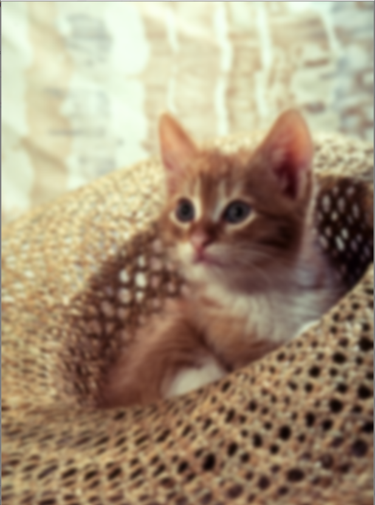

# Gaussian-Blur-Effect
In Gaussian Blur operation, the image is convolved with a **Gaussian filter** <br>
The Gaussian filter is a low-pass filter that removes the high-frequency components are reduced.<br>
This a very important bluring method.<br>

## Tools and Languages:


<br>

## Installation
Use the package manager [pip](https://pip.pypa.io/en/stable/) to install cv2 and numpy.


```bash
pip install cv2
pip install numpy
```

## Import
Use [import](https://www.w3schools.com/python/ref_keyword_import.asp) keyword to import modules.
```python
import cv2
import numpy as np
```

## Reading image from file

```python
img = cv2.imread("cat.png")
```


## Gussian blur effect
 
```python
gauss = cv2.GaussianBlur(img,ksize=(15,15),sigmaX=0,sigmaY=0)
```

## Completion message

```python
print('Gaussian Blur Applied.')
```

## Comparing original vs grayscale

```python
cv2.imshow('original',img)
cv2.imshow('gauss',gauss)
cv2.waitKey(0)
cv2.destroyAllWindows()
```

## Images
<p align="center">
	
	
</p>

### Developed by
 [Ashish ku. Behera](https://github.com/ashish-max "Github Id")
